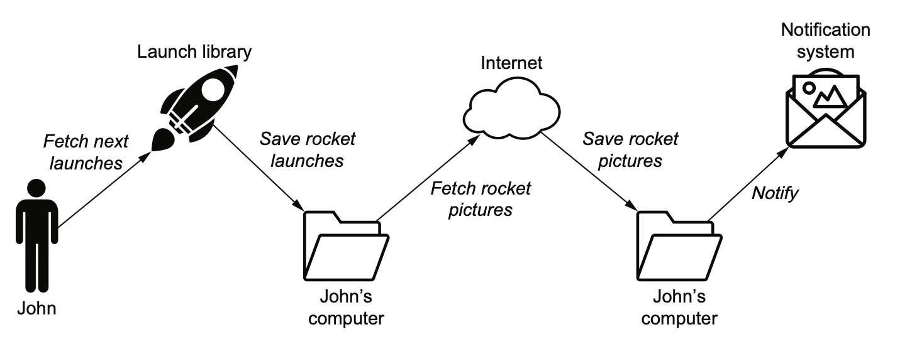

This repository contains project that helps to learn Airflow.

DAG 1 - Download Rocket launch

  This is a simple dag that will download rocket launch details from webpage and save it in a local disk and notify the same in terminal.

